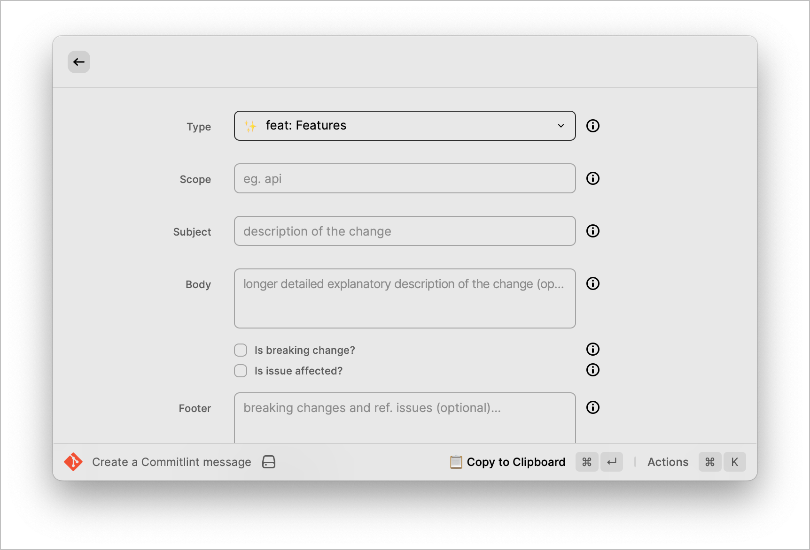
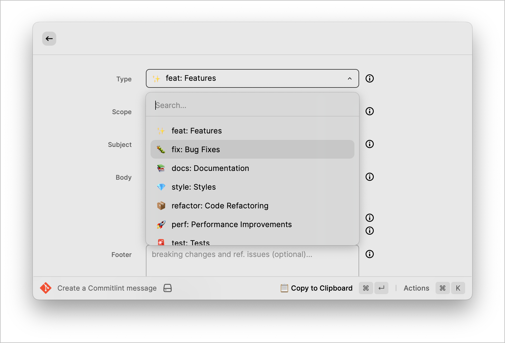

# GitCommitlint

Create a commit message with a commitlint compliant format.

## Screenshots

## References:

1. [commitlint.js.org]( https://commitlint.js.org/#/reference-prompt?id=settings)
2. [Commitlint](https://github.com/conventional-changelog/commitlint)
3. [Raycast Commitlint Extension](https://github.com/raycast/extensions/tree/main/extensions/commitlint)
4. [Raycast API](https://developers.raycast.com/api-reference/user-interface/form)